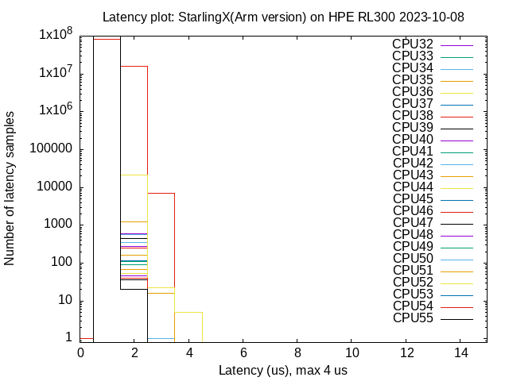
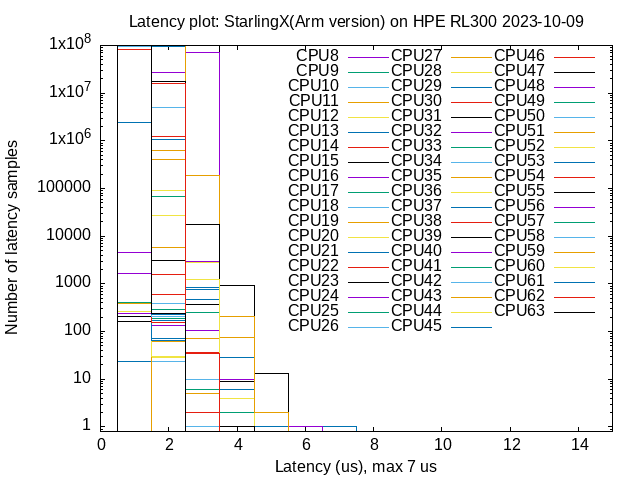
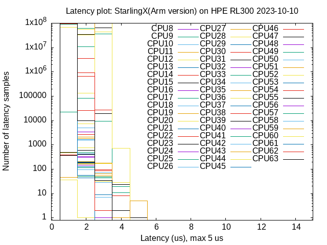
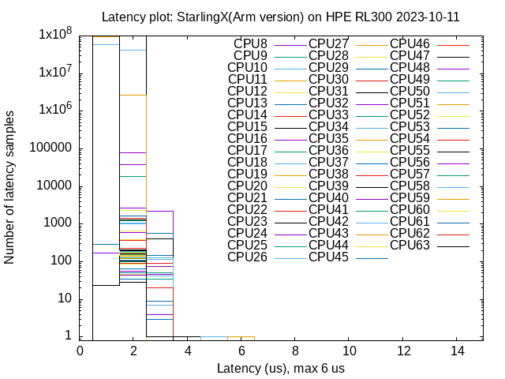
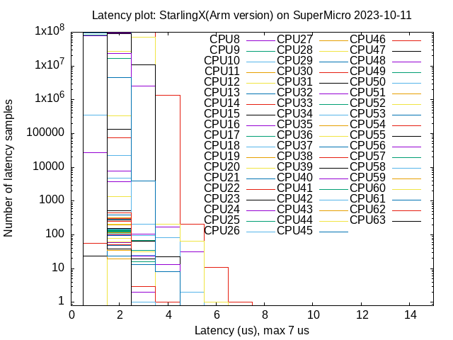
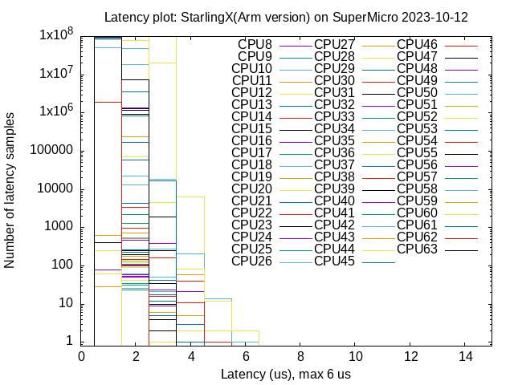
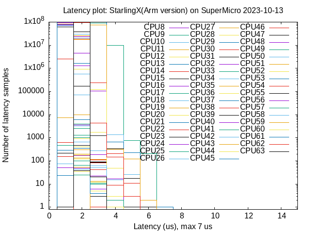
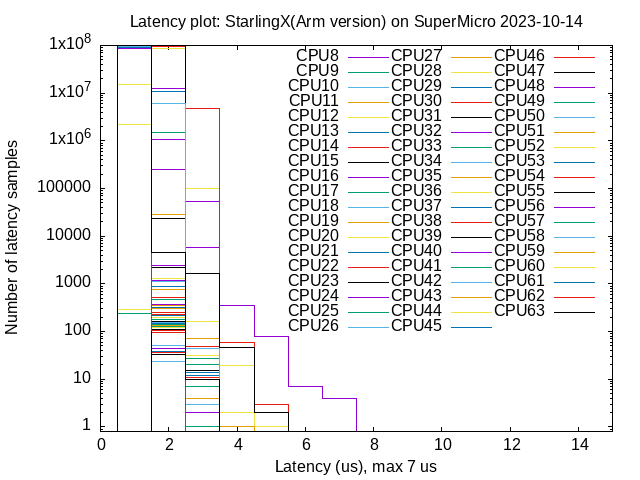
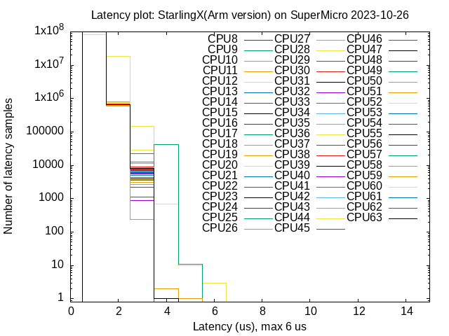

# Deploy StarlingX on Arm with Low Lantency Profile and Run cyclictest

## Test reulsts


### Test result matrix

| #   | Host       | CPU                          | Mem  | Deployment       | isolated cores | tested cores | tested threads | Max |
| --- | ---------- | ---------------------------- | ---- | ---------------- | -------------- | ------------ | -------------- | --- |
| 1   | HPE RL300  | Ampere Altra 3000MHz 80cores | 256G | StarlingX AIO-SX | 8-63           | 32-55        | 24             | 4us |
| 2   | HPE RL300  | Ampere Altra 3000MHz 80cores | 256G | StarlingX AIO-SX | 8-63           | 8-63         | 56             | 7us |
| 3   | HPE RL300  | Ampere Altra 3000MHz 80cores | 256G | StarlingX AIO-SX | 8-63           | 8-63         | 56             | 5us |
| 4   | HPE RL300  | Ampere Altra 3000MHz 80cores | 256G | StarlingX AIO-SX | 8-63           | 8-63         | 56             | 6us |
| 5   | SuperMicro | Ampere Altra 3000MHz 80cores | 512G | StarlingX AIO-SX | 8-63           | 8-63         | 56             | 7us |
| 6   | SuperMicro | Ampere Altra 3000MHz 80cores | 512G | StarlingX AIO-SX | 8-63           | 8-63         | 56             | 6us |
| 7   | SuperMicro | Ampere Altra 3000MHz 80cores | 512G | StarlingX AIO-SX | 8-63           | 8-63         | 56             | 7us |
| 8   | SuperMicro | Ampere Altra 3000MHz 80cores | 512G | StarlingX AIO-SX | 8-63           | 8-63         | 56             | 7us |
| 9   | SuperMicro | Ampere Altra 3000MHz 80cores | 512G | StarlingX AIO-SX | 8-63           | 8-63         | 56             | 6us |

### Testing command

```
# -l: number of loops
# -m: lock current and future memory allocations
# -p: priority of highest prio thread
# -i: base interval of thread in us
# -h: dump a latency histogram to stdout after the run
#     US is the max latency time to be be tracked in microseconds
# -t: number of threads
# -a: run thread #N on processor #N, if possible
#     with NUM pin all threads to the processor NUM

# for v1.50
cyclictest -l100000000 -m -p90 -i200 -h50 -t $cores -a ${c_start}-${c_end}

# for v2.60
#  --mainaffinity=CPUSET
#    Run the main thread on CPU #N. This only affects the main thread and not the measurement threads
cyclictest -l100000000 -m -p90 -i200 -h50 -t $cores -a ${c_start}-${c_end} --mainaffinity=0
```

### Test result plots











## Test Steps


### 1. AIO-SX (lowlatency) Deployment and test on HPE RL300

#### 1.0 HW info: HPE RL300 Gen11

* Product Name: ProLiant RL300 Gen11
* CPU: 
  * Ampere(R) Altra(R) Processor
  * 3000 MHz
  * 80/80 cores; 80 threads
* Memory: 16G 3200MHz X 16 = 256G
* Network:
  * Mellanox MT2894 Family [ConnectX-6 Lx] Adapter
* Disks:
  * nvme0n1: VO001920KYDMT 1T

#### 1.1 Installation

```
wget http://128.224.115.20:5088/3_open_source/stx/images-arm64/build-img-gigabyte-master_20230719/output/starlingx-arm64-20230719081901-cd-nvme.iso
sudo dd if=./starlingx-arm64-20230719081901-cd-nvme.iso of=/dev/sda status=progress
```

* Make the following menu selections in the installer:
  * First menu: Select 'UEFI Debian All-in-one (lowlatency)'
  * Second menu: Select ‘Graphical Console’ or ‘Serial Console’ depending on your terminal access to the console port.

* Wait for non-interactive installation to complete and server to reboot.

#### 1.2 Bootstrap

* Login using the username/password of “sysadmin” / “sysadmin” and change the password to “Li69nux*”

```
export OAM_DEV=enP2p1s0f0
export OAM_VLAN=enP2p1s0f0.5
export OAM_NETWORK=147.11.89
export OAM_IP=201
export OAM_SUB=147.11.89.0/22

export CONTROLLER0_OAM_CIDR=${OAM_NETWORK}.${OAM_IP}/22
export DEFAULT_OAM_GATEWAY=147.11.88.1

sudo ip link add link $OAM_DEV name $OAM_VLAN type vlan id 5
sudo ip address add $CONTROLLER0_OAM_CIDR dev $OAM_VLAN
sudo ip link set up dev $OAM_DEV
sudo ip link set up dev $OAM_VLAN
sudo ip route add default via $DEFAULT_OAM_GATEWAY dev $OAM_VLAN

echo "nameserver 147.11.57.128" | sudo tee -a /etc/resolv.conf

sed -i 's/#alias/alias/' .bashrc
. ~/.bashrc

cat <<EOF > localhost.yml
system_mode: simplex
external_oam_subnet: ${OAM_SUB}
external_oam_gateway_address: ${DEFAULT_OAM_GATEWAY}
external_oam_floating_address: ${OAM_NETWORK}.${OAM_IP}

dns_servers:
  - 147.11.57.128

admin_password: Li69nux*
ansible_become_pass: Li69nux*

offline_img_dir: /home/sysadmin/docker_img_arm64

EOF

wget http://128.224.115.20:5088/3_open_source/stx/images-arm64/docker_img/docker_img_arm64_20230710.tar.gz
tar xvf docker_img_arm64_20230710.tar.gz

ansible-playbook -vvv /usr/share/ansible/stx-ansible/playbooks/bootstrap.yml
```

#### 1.3 Configure after bootstrap

```
source /etc/platform/openrc

OAM_IF=enP2p1s0f0
system host-if-modify controller-0 $OAM_IF -c platform -n oam0
system host-if-add -V 5 controller-0 oam0.5 vlan oam0
system interface-network-assign controller-0 oam0.5 oam

# isolate cpus 8-63
# ref: https://docs.starlingx.io/admintasks/kubernetes/isolating-cpu-cores-to-enhance-application-performance.html
system host-cpu-modify -f application-isolated -c 8-63 controller-0

# unlock controller-0
system host-unlock controller-0
```

* check kernel boot cmdline after reboot
```
[sysadmin@controller-0 ~(keystone_admin)]$ cat /proc/cmdline
BOOT_IMAGE=/1/vmlinuz-5.10.0-6-rt-arm64 rw rootwait ostree_boot=LABEL=otaboot ostree_root=/dev/mapper/cgts--vg-root--lv rd.lvm.lv=cgts/root-lv ostree_var=/dev/mapper/cgts--vg-var--lv ostree=/ostree/1 console=ttyAMA0,115200 console=tty1 nohz_full=8-63 isolcpus=nohz,domain,managed_irq,8-63 rcu_nocbs=1-78 kthread_cpus=0,79 irqaffinity=1-7,64-78 audit=0 audit_backlog_limit=8192 intel_idle.max_cstate=0 multi-drivers-switch=cvl-4.0.1 intel_pstate=none nopti nospectre_v2 nospectre_v1 hugepagesz=1G hugepages=20 hugepagesz=2M hugepages=0 default_hugepagesz=1G crashkernel=2048M apparmor=0 security=apparmor
```

* Confirmed that the kernel work queues are already away from isolated cores
```
# The cpumask 8000,00000000,00000001 allows the workqueue to run on CPU 0 and no other CPUs.
[sysadmin@controller-0 ~(keystone_admin)]$ find /sys/devices/virtual/workqueue/ -name cpumask -exec sh -c 'cat {}' ';'|uniq
8000,00000000,00000001
```


### 1.4 Run cyclictest

* Install rt-tests

```
sudo ostree admin unlock --hotfix
wget https://ftp.up.pt/pub/debian/pool/main/r/rt-tests/rt-tests_1.5-2_arm64.deb
sudo dpkg -i rt-tests_1.5-2_arm64.deb
```

* script to run cyclictest
  * Ref: https://www.osadl.org/Create-a-latency-plot-from-cyclictest-hi.bash-script-for-latency-plot.0.html
  * [mklatencyplot.bash](./20231010_stx_on_arm_rt_cyclictest/mklatencyplot.bash)

* Run the script:
```
sudo su -
mkdir run_cyclictest
scp <host_script_located>:/path/to/mklatencyplot.bash run_cyclictest
cd run_cyclictest
./mklatencyploy.bash
```

* copy the results to a host that have gnuplot
```
scp -r run_cyclictest <host_have_gnuplot>:/path/to/results/

# on the host that have gnuplot
cd /path/to/results/run_cyclictest
gnuplot -persist <plotcmd
```

### 2. AIO-SX (lowlatency) Deployment and test on SuperMicro

#### 2.0 HW info: SuperMicro

* Model: R12SPD-A
* CPU: 
  * Part number: Q80-30 
  * Model: Ampere(R) Altra(R) Processor 80 cores; 80 threads
  * Arch: ARMv8
* Memory: 32G x 16 = 512G DDR4 3200
* Disks:
  * NVMe1(M.2): Samsung MZ1L2960HCJR-00A07 1T
* Network controller:
  * Mellanox Technologies MT27710 Family [ConnectX-4 Lx]

#### 2.1 Installation

```
wget http://128.224.115.20:5088/3_open_source/stx/images-arm64/build-img-gigabyte-master_20230719/output/starlingx-arm64-20230719081901-cd-nvme.iso
sudo dd if=./starlingx-arm64-20230719081901-cd-nvme.iso of=/dev/sda status=progress
```

* Make the following menu selections in the installer:
  * First menu: Select 'UEFI Debian All-in-one (lowlatency)'
  * Second menu: Select ‘Graphical Console’ or ‘Serial Console’ depending on your terminal access to the console port.

* Wait for non-interactive installation to complete and server to reboot.

#### 2.2 Bootstrap

* Login using the username/password of “sysadmin” / “sysadmin” and change the password to “Li69nux*”

```
export OAM_DEV=eno1
export OAM_NETWORK=128.224.115
export OAM_IP=212
export OAM_SUB=128.224.115.0/24

export CONTROLLER0_OAM_CIDR=${OAM_NETWORK}.${OAM_IP}/24
export DEFAULT_OAM_GATEWAY=128.224.115.1

sudo ip address add $CONTROLLER0_OAM_CIDR dev $OAM_DEV
sudo ip link set up dev $OAM_DEV
sudo ip route add default via $DEFAULT_OAM_GATEWAY dev $OAM_DEV

sed -i 's/#alias/alias/' .bashrc
. ~/.bashrc

ALA_PROXY="http://147.11.252.42:9090"

cat <<EOF > localhost.yml
system_mode: simplex

name: "stx-arm-aio-sx"
description: "PEK SE ARM AIO-SX"
location: "PEK SE Lab"

external_oam_subnet: ${OAM_SUB}
external_oam_gateway_address: ${DEFAULT_OAM_GATEWAY}
external_oam_floating_address: ${OAM_NETWORK}.${OAM_IP}

dns_servers:
  - 128.224.160.11
  - 128.224.160.12

admin_password: Li69nux*
ansible_become_pass: Li69nux*

#offline_img_dir: /home/sysadmin/docker_img_arm64

docker_http_proxy: $ALA_PROXY
docker_https_proxy: $ALA_PROXY

EOF

wget http://128.224.115.20:5088/3_open_source/stx/images-arm64/docker_img/docker_img_arm64_20230710.tar.gz
tar xvf docker_img_arm64_20230710.tar.gz

ansible-playbook -vvv /usr/share/ansible/stx-ansible/playbooks/bootstrap.yml
```


#### 2.3 Configure after bootstrap

```
source /etc/platform/openrc

OAM_IF=eno1
system host-if-modify controller-0 $OAM_IF -c platform
system interface-network-assign controller-0 $OAM_IF oam

# isolate cpus
# ref: https://docs.starlingx.io/admintasks/kubernetes/isolating-cpu-cores-to-enhance-application-performance.html
system host-cpu-modify -f application-isolated -c 8-63 controller-0

# unlock controller-0
system host-unlock controller-0
```

* check kernel boot cmdline after reboot
```
[sysadmin@controller-0 ~(keystone_admin)]$ cat /proc/cmdline
BOOT_IMAGE=/1/vmlinuz-5.10.0-6-rt-arm64 rw rootwait ostree_boot=LABEL=otaboot ostree_root=/dev/mapper/cgts--vg-root--lv rd.lvm.lv=cgts/root-lv ostree_var=/dev/mapper/cgts--vg-var--lv ostree=/ostree/1 console=ttyAMA0,115200 console=tty1 iommu=pt nmi_watchdog=0 softlockup_panic=0 intel_iommu=on skew_tick=1 efi=runtime selinux=0 enforcing=0 softdog.soft_panic=1 systemd.unified_cgroup_hierarchy=0 user_namespace.enable=1 biosdevname=0 nopti nospectre_v2 nospectre_v1 nohz_full=8-63 isolcpus=nohz,domain,managed_irq,8-63 rcu_nocbs=1-78 kthread_cpus=0,79 irqaffinity=1-7,64-78 audit=0 audit_backlog_limit=8192 intel_idle.max_cstate=0 multi-drivers-switch=cvl-4.0.1 intel_pstate=none hugepagesz=2M hugepages=0 default_hugepagesz=2M crashkernel=2048M apparmor=0 security=apparmor
```

* Confirmed that the kernel work queues are already away from isolated cores

```
# The cpumask 8000,00000000,00000001 allows the workqueue to run on CPU 0 and no other CPUs.
[sysadmin@controller-0 ~(keystone_admin)]$ find /sys/devices/virtual/workqueue/ -name cpumask -exec sh -c 'cat {}' ';'|uniq
8000,00000000,00000001

```

### 2.4 Run cyclictest

* Install rt-tests

```
sudo ostree admin unlock --hotfix
wget https://ftp.up.pt/pub/debian/pool/main/r/rt-tests/rt-tests_1.5-2_arm64.deb
sudo dpkg -i rt-tests_1.5-2_arm64.deb
```

* script to run cyclictest
  * Ref: https://www.osadl.org/Create-a-latency-plot-from-cyclictest-hi.bash-script-for-latency-plot.0.html
  * [mklatencyplot.bash](./20231010_stx_on_arm_rt_cyclictest/mklatencyplot.bash)

* Run the script:
```
sudo su -
mkdir run_cyclictest
scp <host_script_located>:/path/to/mklatencyplot.bash run_cyclictest
cd run_cyclictest
./mklatencyploy.bash
```

* copy the results to a host that have gnuplot
```
scp -r run_cyclictest <host_have_gnuplot>:/path/to/results/

# on the host that have gnuplot
cd /path/to/results/run_cyclictest
gnuplot -persist <plotcmd
```
